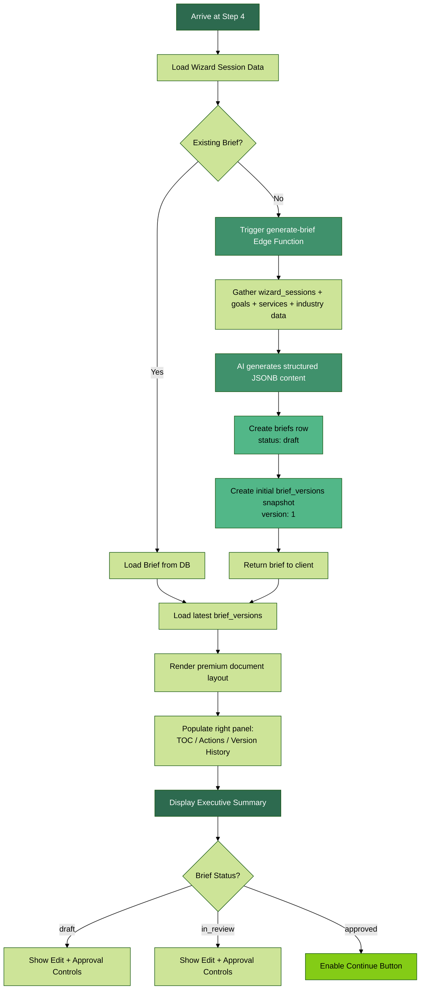
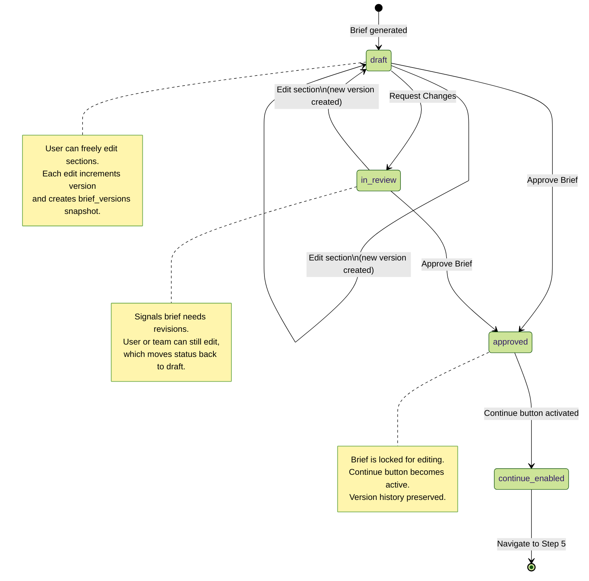
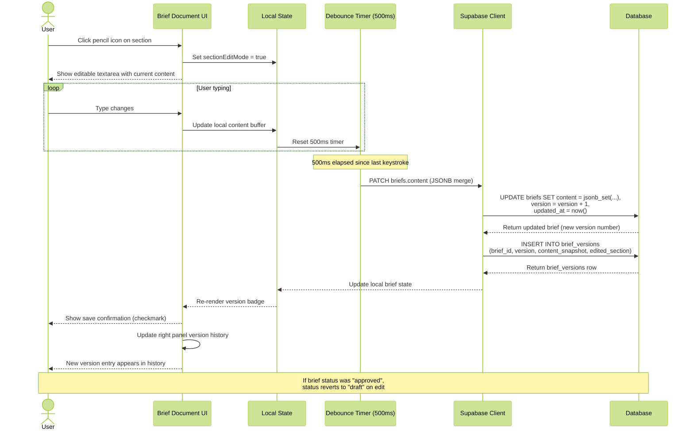
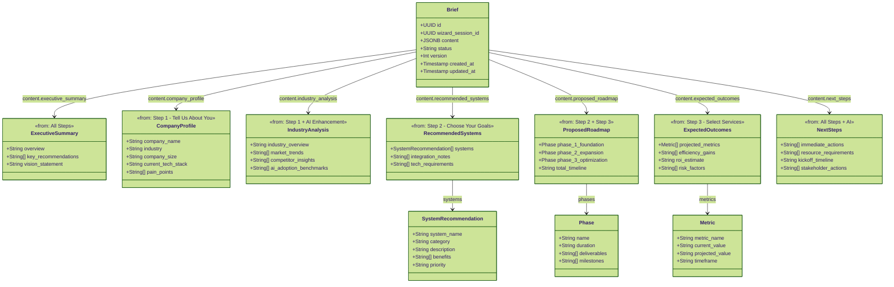

# Step 4 - Executive Summary

AI generates a full strategy brief rendered as a premium document.

**Sections:** Executive Summary, Company Profile, Industry Analysis, Recommended Systems, Proposed Roadmap (3 phases), Expected Outcomes, Next Steps.

**Features:**
- Inline editing on each section (pencil icon -> edit mode -> auto-save)
- Versioning: each edit creates a new `brief_versions` snapshot
- Right panel: table of contents, document actions (PDF/Print/Share), version history
- Approval flow: user can "Request Changes" (status -> in_review) or "Approve Brief" (status -> approved)
- Continue only active after approval

---

## 1. Brief Generation Flow

Flowchart: arrive at step-4 -> load wizard data -> check for existing brief -> if exists: display -> if not: trigger Edge Function -> generate structured JSONB -> create briefs row -> create brief_versions -> display.

---

## 2. Brief Approval State Machine

State diagram: draft -> [edit] -> draft (new version) -> [request changes] -> in_review -> [edit] -> draft -> [approve] -> approved -> continue enabled.

---

## 3. Inline Editing Sequence

Sequence diagram: User clicks edit -> section enters edit mode -> user types -> debounce 500ms -> update briefs.content -> increment version -> create brief_versions snapshot -> update version history panel.

---

## 4. Brief Document Structure

Class diagram showing the brief sections and their data sources (which wizard step feeds each section).

