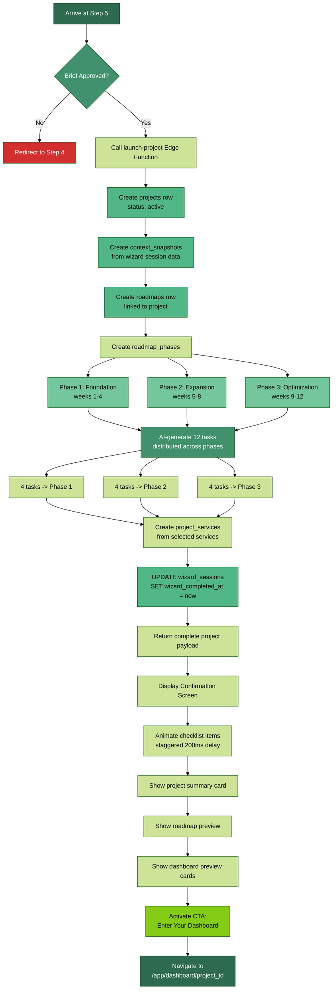
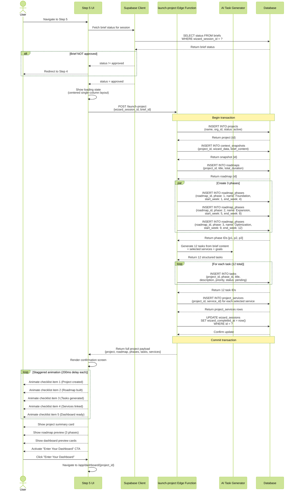
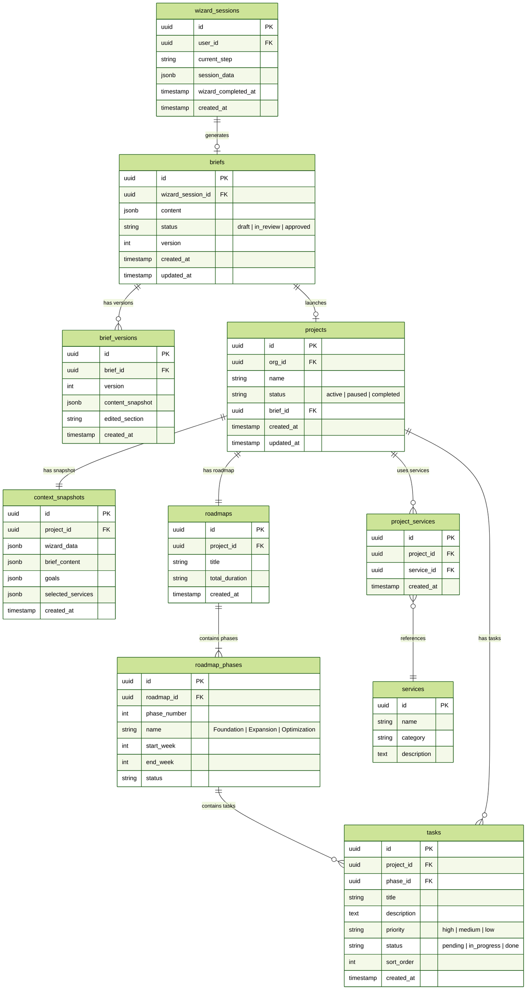
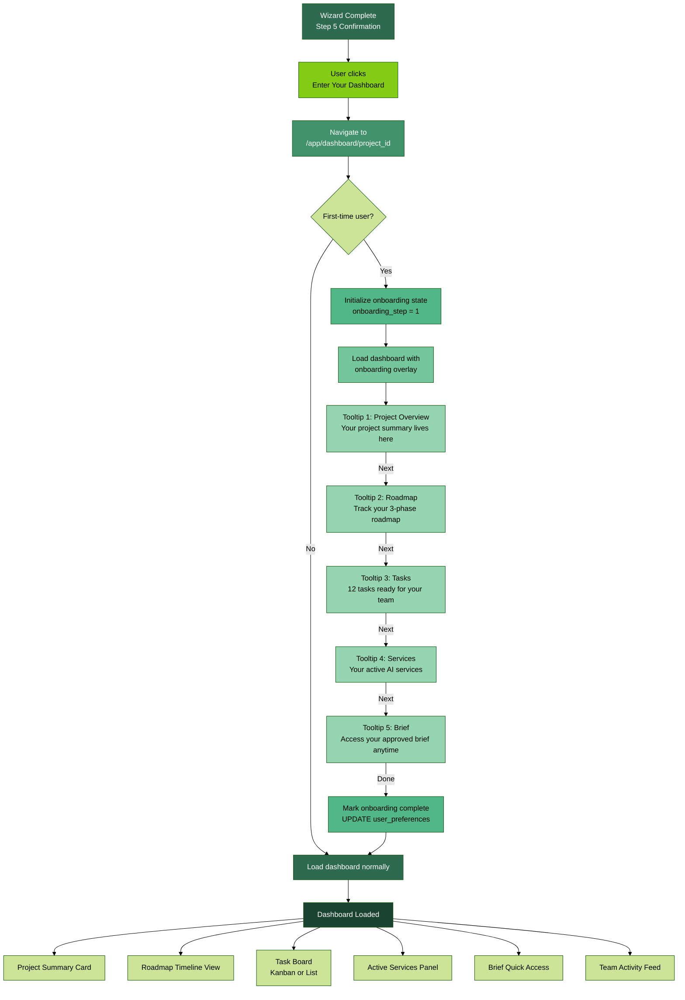

# Step 5 - Launch Project

Final confirmation screen. Breaks from three-panel layout to centered single-column. Project creation happens in background.

**Behavior:**
- Verifies brief is approved (redirects back to step-4 if not)
- Creates: project, context_snapshots, roadmaps, roadmap_phases (3), tasks (12 AI-generated), project_services
- Updates wizard_sessions.wizard_completed_at
- Shows: project summary card, roadmap preview (3 phases), checklist with staggered animation, dashboard preview cards
- CTA: "Enter Your Dashboard" -> /app/dashboard/{project_id}

---

## 1. Project Creation Flow

Flowchart: verify brief approved -> create project -> create context_snapshot -> create roadmap -> create 3 phases -> AI-generate tasks -> create project_services -> update wizard_sessions -> display confirmation.

---

## 2. Project Creation Sequence

Sequence diagram: User arrives -> verify brief -> Edge Function -> create project row -> create snapshot -> create roadmap -> create phases -> generate tasks -> create services -> return confirmation -> animate checklist.

---

## 3. Project Data ERD

ERD showing all tables created during project launch: projects, context_snapshots, roadmaps, roadmap_phases, tasks, project_services, briefs -- and their relationships.

---

## 4. Dashboard Transition

Flowchart: wizard complete -> "Enter Dashboard" click -> navigate to /app/dashboard/{id} -> first-time onboarding tooltips.

